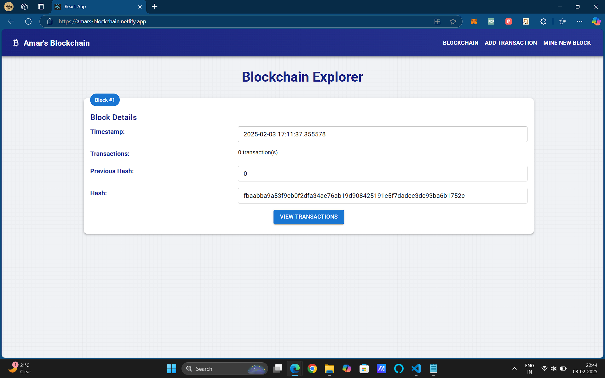
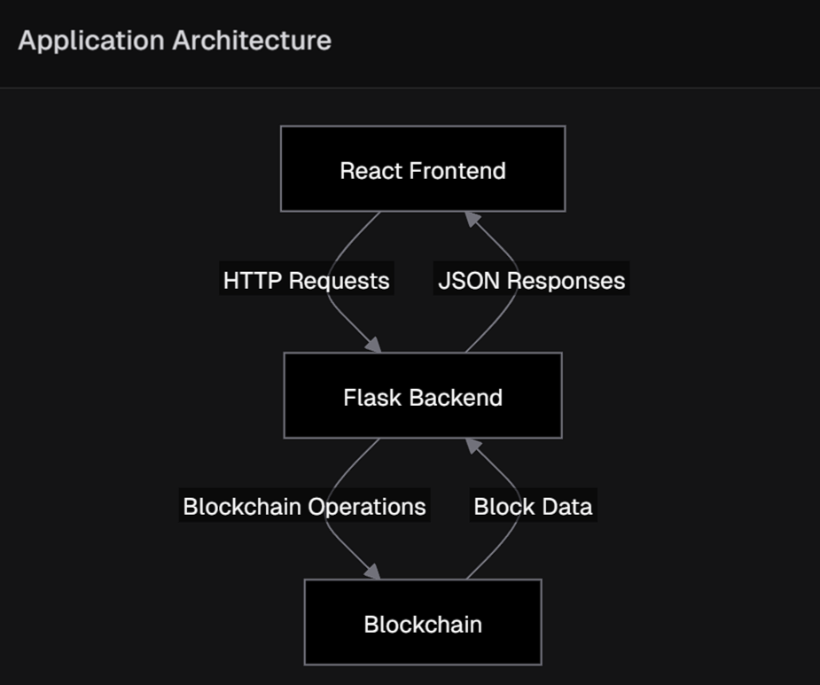

# 🌐 Amar's Blockchain Explorer

## 🚀 Live Demo

[Explore the Blockchain](https://amars-blockchain.netlify.app/)

## 📖 Table of Contents

- [About the Project](#about-the-project)
- [Features](#features)
- [Tech Stack](#tech-stack)
- [Getting Started](#getting-started)
  - [Prerequisites](#prerequisites)
  - [Installation](#installation)
- [Usage](#usage)
- [Architecture](#architecture)
- [API Endpoints](#api-endpoints)
- [Deployment](#deployment)
- [Contributing](#contributing)
- [License](#license)
- [Contact](#contact)

## 🧐 About The Project

Amar's Blockchain Explorer is a full-stack web application that allows users to interact with and visualize a simple blockchain. It demonstrates the core concepts of blockchain technology, including block creation, transaction management, and the chain's immutability.



## ✨ Features

- 📊 Real-time blockchain visualization
- 💼 Add new transactions to the blockchain
- ⛏️ Mine new blocks
- 🔍 Explore detailed transaction information within each block
- 🔗 View the entire blockchain structure

## 🛠️ Tech Stack

- **Frontend**: React, Material-UI
- **Backend**: Python, Flask
- **Deployment**: Render (Backend), Netlify (Frontend)

## 🚀 Getting Started

### Prerequisites

- Node.js (v14+)
- Python (v3.9+)
- pip

### Installation

1. Clone the repo
   ```sh
   git clone https://github.com/your_username/rabbittai-blockchain.git
    ```

2. Install frontend dependencies

    ```sh
    cd frontend
    npm install
    ```


3. Install backend dependencies

    ```shellscript
    cd server

    # Activate the virtual environment if not already activated
    # On Windows
    venv\Scripts\activate
    # On macOS and Linux
    source venv/bin/activate

    #install dependencies
    pip install -r requirements.txt

    ```


## 💻 Usage

1. Start the backend server

    ```shellscript
    cd server
    python node.py
    ```


2. In a new terminal, start the frontend

    ```shellscript
    cd frontend
    npm start
    ```


3. Open your browser and navigate to `http://localhost:3000`


## 🏗️ Architecture

The application follows a client-server architecture:




## 🔗 API Endpoints

- `GET /get_chain`: Retrieve the entire blockchain
- `POST /add_transaction`: Add a new transaction to the blockchain
- `GET /mine_block`: Mine a new block


Example API call:

```javascript
async function getBlockchain() {
  const response = await fetch('https://blockchain-backend.onrender.com/get_chain');
  const data = await response.json();
  console.log(data.chain);
}
```

## 🚢 Deployment

The project is deployed using Render for the backend and Netlify for the frontend.

### Backend Deployment (Render)

1. Create a `render.yaml` file in your project root:


```yaml
services:
  - type: web
    name: blockchain-backend
    env: python
    buildCommand: pip install -r server/requirements.txt
    startCommand: gunicorn server.node:app
    envVars:
      - key: PYTHON_VERSION
        value: 3.9.0
```

2. Connect your GitHub repo to Render and create a new Web Service.


### Frontend Deployment (Netlify)

1. Build your React app:

```shellscript
npm run build
```


2. Deploy using Netlify CLI:

```shellscript
netlify deploy --prod
```


## 🤝 Contributing

Contributions are what make the open source community such an amazing place to learn, inspire, and create. Any contributions you make are **greatly appreciated**.

1. Fork the Project
2. Create your Feature Branch (`git checkout -b feature/AmazingFeature`)
3. Commit your Changes (`git commit -m 'Add some AmazingFeature'`)
4. Push to the Branch (`git push origin feature/AmazingFeature`)
5. Open a Pull Request


## 📝 License

Distributed under the MIT License. See `LICENSE` for more information.

## 📧 Contact

Amar - [@Tiwari__Amar](https://x.com/Tiwari__Amar) - [amar.tiwari.8355@gmail.com](mailto:amar.tiwari.8355@gmail.com)

Project Link: [ My-blockchain](https://github.com/Amar5623/My-blockchain)

---

Built with ❤️ by [Amar](https://github.com/Amar5623)
